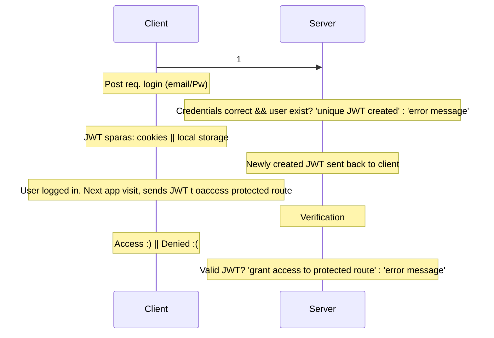

# <h2> JWT STRUCTURE </h2>

```mermaid
sequenceDiagram
  participant Client
  participant Server

Client->>Server :1
  Note over Client: Post req. login (email/Pw)


  Note over Server: Credentials correct && user exist? 'unique JWT created' : 'error message'

  Note over Client: JWT sparas: cookies || local storage

  Note over Server: Newly created JWT sent back to client

  Note over Client: User logged in. Next app visit, sends JWT t oaccess protected route

  Note over Server: Verification

  Note over Client: Access :) || Denied :(

  Note over Server: Valid JWT? 'grant access to protected route' : 'error message'
```
